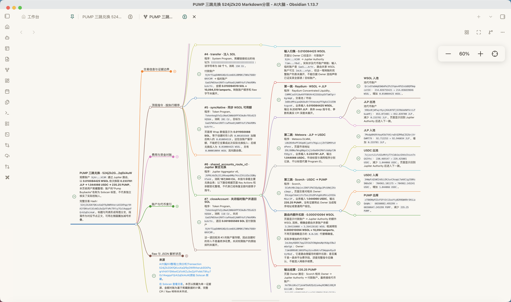
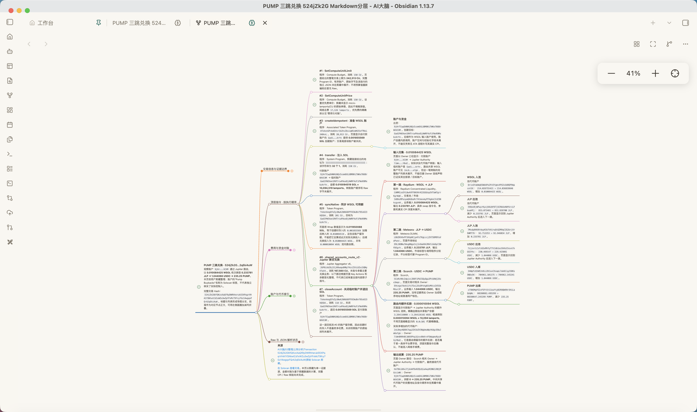
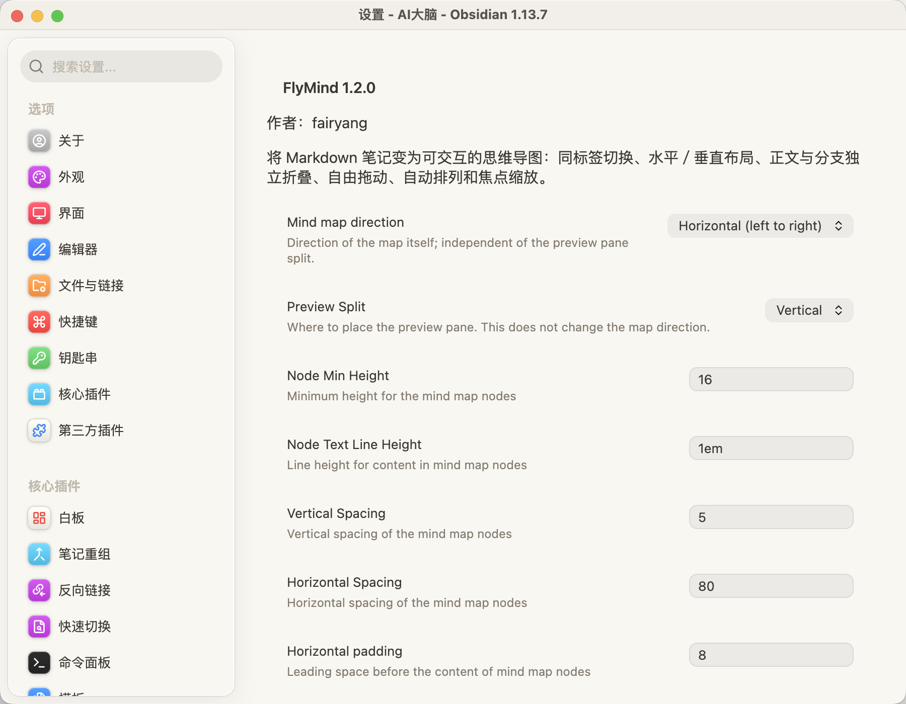

# FlyMind

[](https://github.com/smofox/flymind/releases/tag/1.2.1) [](LICENSE)

## English

**Turn your Markdown notes into interactive mind maps, right inside Obsidian.**

FlyMind provides horizontal and vertical layouts, collapsible node content, freely movable nodes, and zoom controls. Switch between a note and its mind map in the same tab, or open a separate preview pane alongside the original Markdown.

### Features

- **Same-tab switching:** click the brain icon beside the tab title to switch between Markdown and a mind map. Returning to Markdown restores the editor or reading mode and scroll position within the current session.
- **Two layout directions:** display branches from left to right or from top to bottom with consistent node and connector colors.
- **Paragraphs inside nodes:** heading paragraphs and indented list paragraphs become node content instead of extra branches. Inline formatting and links are retained.
- **Independent folding:** the circled plus/minus beside a node controls its body. Connection endpoints control child branches. Folding preserves the zoom level and the clicked control's screen position.
- **Free positioning:** drag nodes to arrange them; connectors follow. The automatic-layout button restores the default arrangement without resetting zoom or fold states.
- **Floating zoom controls:** zoom around the visible pane center, see the current percentage, or fit the entire map to the pane.
- **Separate preview:** follow the active Markdown note or pin the preview to one note. Horizontal split means side by side; vertical split means stacked panes.

### Installation

1. Download `main.js` and `manifest.json` from the [latest GitHub release](https://github.com/smofox/flymind/releases/latest), or extract the `FlyMind-1.2.1.zip` archive.
2. Place both files in `<vault>/.obsidian/plugins/flymind/`.
3. Restart Obsidian and enable **FlyMind** under Community plugins. Keep your existing `data.json` when upgrading.

The manifest declares Obsidian **1.0.0 or later**. Development and screenshot verification have primarily used desktop Obsidian; mobile interaction has not been tested on a physical device.

### Usage and limitations

Open a Markdown note and click the brain icon next to its tab title. Use the preview header to change layout direction or restore automatic positioning. To open a separate pane, run the FlyMind preview command from the command palette.

Manual positions and body-fold states are kept only for the current preview session while the source remains unchanged. They are not written into Markdown and reset when the preview is reopened or its source changes. Indent paragraphs under list items to associate them with that list node.

### Development and credits

Run `npm install`, `npm test`, `npm run typecheck`, and `npm run build`. Installable files are generated in `dist/`. Bug reports are welcome in [Issues](https://github.com/smofox/flymind/issues); include the layout direction, reproduction steps, and a minimal Markdown example.

Maintained by **fairyang**. Based on James Lynch's [Obsidian Mind Map](https://github.com/lynchjames/obsidian-mind-map) and Markmap. Distributed under the [MIT License](LICENSE), with the original copyright notice preserved.

## 中文说明

**让笔记变成可以展开、移动和探索的思维导图。**

**版本：1.2.1** · Obsidian 交互式思维导图插件

**作者：fairyang** · 原始项目作者：James Lynch

将 Markdown 笔记转换为可浏览、可折叠、可自由排列的思维导图。基于 Markmap 和 James Lynch 的 Obsidian Mind Map 扩展开发。

## 预览

### 水平思维导图

标题与列表形成层级分支，段落显示在节点内部；右上角悬浮工具条提供缩放和适配画布。



### Markdown 与导图并排查看

在独立预览窗格中对照原文与导图；也可以点击标签旁的大脑图标，在同一标签内切换视图。


<details>
<summary>查看导图全景、Markdown 阅读视图和插件设置</summary>

#### 导图全景

缩小画布后浏览完整层级结构。



#### Markdown 阅读视图

笔记仍以 Markdown 保存，能够随时返回原文阅读。


#### 插件设置

调整导图方向、预览分屏、节点行高和间距。截图为较早的设置界面；当前分屏选项已明确标注 **Horizontal（左右并排）／Vertical（上下排列）**。



</details>

## 功能

- **同标签切换**：点击标签右侧的大脑图标，在 Markdown 与思维导图间切换；切换前保存笔记，切回时恢复本次会话中的编辑／阅读模式和滚动位置。
- **双向布局**：水平从左向右、垂直从上向下，统一节点配色与连线端点样式。
- **节点正文**：标题下的段落、列表项内缩进段落作为对应节点内容，支持多段文字、强调、行内代码和链接。
- **独立折叠**：左侧圆圈加减号控制正文，连线端点控制子分支；点击正文不会折叠分支。折叠时保留当前缩放和操作位置。
- **自由排列**：拖动节点，连线同步移动；“自动”按钮恢复自动布局，保留缩放与折叠状态。
- **焦点缩放**：右上角悬浮条提供减号、实时百分比、加号和适配画布；加减围绕当前可视区域中心缩放。
- **独立预览**：通过命令打开预览窗格，支持跟随当前 Markdown 笔记或固定笔记。
- **辅助操作**：支持笔记链接、Markdown 分支折叠提示和复制导图截图。

手动位置与正文折叠状态仅保留在当前未改变源内容的预览会话中，不写入 Markdown。关闭、重新打开预览或修改源笔记后会重新生成布局。

## 使用

1. 启用 FlyMind，打开 Markdown 笔记。
2. 点击标签标题右侧的大脑图标切换为思维导图，再次点击返回笔记。
3. 在导图顶部切换布局，拖动节点或使用悬浮缩放条浏览。
4. 在设置 → FlyMind 调整布局方向、间距和文字行高。

列表项正文需要缩进到列表内容列，例如：

```markdown
# 创建账户

这段正文显示在标题节点内。

- 账户说明

  这段正文显示在列表节点内。

  - 这是子分支
```

## 安装与升级

项目地址：[smofox/flymind](https://github.com/smofox/flymind)。从 [最新 Release](https://github.com/smofox/flymind/releases/latest) 下载 `main.js`、`manifest.json` 或 FlyMind 安装包。GitHub 自动生成的 Source code ZIP 需要先构建，不是可直接安装的插件包。

从源码构建：

```sh
git clone https://github.com/smofox/flymind.git
cd flymind
npm install
npm run build
```

将生成的 `dist/main.js` 与 `dist/manifest.json` 复制到下面的插件目录。

将发布包内的 `main.js` 和 `manifest.json` 放入仓库的 `.obsidian/plugins/flymind/`，重新启用插件或重启 Obsidian。升级时保留 `data.json`。

显示名称为 FlyMind，内部插件 ID 和安装目录名均为 `flymind`。从旧版迁移时，需将原目录中的 `data.json` 一并迁移，并将启用列表和自定义快捷键中的旧插件 ID 更新为 `flymind`。

## 开发

```sh
npm install
npm test
npm run typecheck
npm run build
```

构建输出位于 `dist/`。自动化检查涵盖正文解析、折叠、布局、拖动、同标签切换和缩放控件。

## 常见问题

**打开笔记后仍显示 Markdown？** 点击标签标题旁的大脑图标。单纯打开 Markdown 文件不会自动进入导图模式。

**如何分别折叠正文和子分支？** 节点左侧的圆圈加减号控制正文；连线端点及折叠提示加号控制子分支。

**拖动位置会永久保存吗？** 当前版本只保留在预览会话中。点击“自动”恢复自动排列；修改源笔记会重新生成布局。

**升级后仍显示旧名称或旧界面？** 重启 Obsidian；从旧插件迁移时确认启用的是 `flymind`，并保留原来的 `data.json`。

问题反馈请提交到 [Issues](https://github.com/smofox/flymind/issues)，附上布局方向、复现步骤与最小 Markdown 示例。当前主要在桌面端使用，移动端交互尚未实机验证。

## 1.2.1 更新

根据社区检查补充英文功能、安装和使用说明；插件清单使用英文简介与标准句末标点，移除不受支持的 `js` 字段。保留中文说明及全部预览图。

## 1.2.0 更新

正式采用 FlyMind 名称，更新插件信息和功能说明；整合同标签切换、双向布局、节点正文折叠、自由排列、自动布局恢复与悬浮缩放功能。

## 致谢与许可证

基于 [James Lynch / Obsidian Mind Map](https://github.com/lynchjames/obsidian-mind-map) 与 Markmap。遵循 MIT 许可证，保留原作者版权声明，详见 LICENSE。
